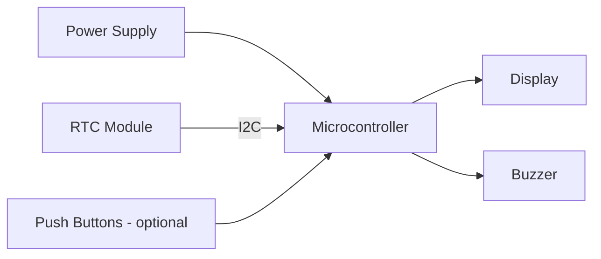
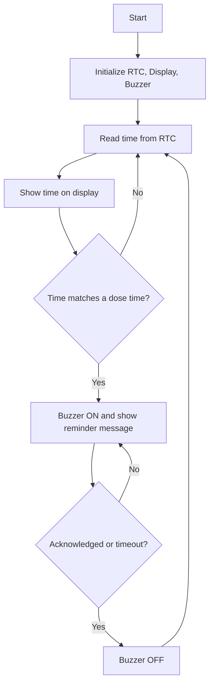

# Smart Medicine Reminder System

An embedded real-time system that tracks time with an RTC module and alerts the user through a buzzer and display when a scheduled medicine dose is due.

## Overview
This project uses a `[MICROCONTROLLER]` and a `[RTC MODULE, e.g. DS1307 / DS3231]` to keep accurate time and compare it with stored dosage times. When the current time matches a scheduled dose, the system triggers a buzzer and shows an alert on the `[DISPLAY TYPE]`.

## Problem Statement
Patients, especially elderly users, often forget to take medicines on time. A simple, low-cost, offline reminder device can help them follow a dosage schedule.

## Features
- [ ] Real-time clock tracking using an RTC module
- [ ] Multiple dosage times scheduled `[CONFIRM NUMBER]`
- [ ] Buzzer alert at scheduled time
- [ ] Display of current time and alert message
- [ ] `[Acknowledge/stop button: keep only if implemented]`

## Technologies Used
| Area | Details |
|---|---|
| Microcontroller | [MODEL] |
| RTC | [MODEL] (I2C) |
| Display | [LCD 16x2 / OLED / other] |
| Alert | Buzzer |
| Language | [Embedded C / Arduino C++] |
| IDE | [Arduino IDE / Keil / other] |
| Libraries | [RTC library, display library] |

## System Architecture (Block Diagram)



## Working Principle
1. On power-up, the microcontroller initializes the RTC, display and buzzer pin.
2. The RTC keeps counting time independently (backed by a battery cell if fitted).
3. The microcontroller reads the current hour and minute from the RTC at regular intervals.
4. It compares the current time with each stored dosage time.
5. If a match occurs, the buzzer turns on and the display shows the reminder message.
6. The alert stops after `[user presses button / fixed duration]`, then the loop continues.

## Firmware Flowchart



## Hardware Requirements
| Component | Quantity | Notes |
|---|---|---|
| [Microcontroller] | 1 | |
| [RTC module] | 1 | Backup battery: [YES/NO] |
| [Display] | 1 | |
| Buzzer | 1 | Active/Passive: [CONFIRM] |
| Push buttons | [N] | Optional |
| Resistors, jumper wires, breadboard/PCB | | |
| Power supply | 1 | [VOLTAGE] |

## Pin Mapping
| Signal | Microcontroller Pin |
|---|---|
| RTC SDA | [PIN] |
| RTC SCL | [PIN] |
| Display pins | [PINS] |
| Buzzer | [PIN] |
| Button(s) | [PIN] |

## Project Structure
```
smart-medicine-reminder-rtc/
├── README.md
├── LICENSE
├── src/                    # firmware source
├── docs/
│   ├── block_diagram.png
│   ├── circuit_diagram.png
│   ├── flowchart.png
│   ├── bill_of_materials.md
│   ├── project_report.pdf
│   └── presentation/
│       └── Smart_Medicine_Reminder.pptx
├── media/                  # photos and demo video link
└── tests/
    └── test_log.md
```

## Installation and Build Procedure
1. Clone the repository: `git clone https://github.com/[USERNAME]/smart-medicine-reminder-rtc.git`
2. Assemble the circuit as per `docs/circuit_diagram.png` and the pin table above.
3. Open `src/[FILE]` in `[IDE]`.
4. Install required libraries: `[LIST]`.
5. Select board `[BOARD]` and port `[PORT]`.
6. Set the initial RTC time (run once, then remove or comment that line): `[HOW YOU SET THE TIME]`.
7. Edit dosage times in `[VARIABLE/ARRAY NAME]`.
8. Upload the code and power the circuit.

## Usage
1. Power the device.
2. Verify the display shows the current time.
3. At each configured dose time the buzzer sounds and the message `[MESSAGE]` appears.
4. `[Describe how to stop the alert]`.

## Testing
| Test | Input | Expected | Observed | Result |
|---|---|---|---|---|
| RTC time display | Power on | Correct time shown | [ADD] | [PASS/FAIL] |
| Single dose alert | Dose time = now + 1 min | Buzzer at that minute | [ADD] | |
| Multiple doses | [N] different times | Alert at each | [ADD] | |
| No-match behavior | Normal time | No alert | [ADD] | |
| Power loss (if battery fitted) | Remove power, restore | Time retained | [ADD] | |

## Screenshots and Media
- Hardware photo: `media/[FILE]`
- Display showing time: `media/[FILE]`
- Alert state: `media/[FILE]`
- Demo video: [LINK]

## Results
[To be added after testing. Describe only what you observed.]

## Limitations
- `[e.g., schedule is fixed in code, needs re-upload to change]`
- `[e.g., no medicine name display]`

## Documentation
| Document | Location |
|---|---|
| Project report | `docs/project_report.pdf` |
| Presentation (PPT) | `docs/presentation/Smart_Medicine_Reminder.pptx` |
| Circuit diagram | `docs/circuit_diagram.png` |
| Bill of materials | `docs/bill_of_materials.md` |
| Test log | `tests/test_log.md` |

## Presentation Outline (for the PPT)
1. Title and team
2. Problem statement
3. Objectives
4. Block diagram
5. Components used
6. Circuit and pin connections
7. Working and flowchart
8. Software and code structure
9. Testing and observations
10. Applications and limitations
11. Future scope
12. Conclusion

## Future Enhancements
- [ ] Store schedule in EEPROM so it survives resets
- [ ] Snooze and acknowledge buttons
- [ ] Display medicine name per dose
- [ ] Wi-Fi board with cloud logging of acknowledged doses (planned, not implemented)

## Author
**Sai Sravani Addagiri**
B.Tech ECE, Lakireddy Bali Reddy College of Engineering
[LinkedIn](https://linkedin.com/in/sai-sravani-addagiri-147640291)

